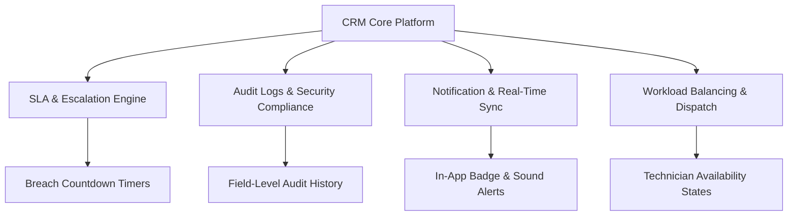

# 🗺️ CRM Ticket System — Strategic Roadmap & Feature Gap Analysis

This roadmap outlines the complete strategic plan to elevate the **304IP CRM Ticket Tracking System** from a highly functional tool into an enterprise-grade, secure, and fully-featured CRM and Operations platform.

---

## 📌 Executive Summary
A comprehensive audit of the application shows a robust core architecture built on Vite, Tailwind CSS, Supabase, and Cloudflare R2. However, to maximize operational efficiency, team accountability, and customer satisfaction, several key features and architectural enhancements should be integrated.



---

## 1. Resolved Issue: Responder Visibility Bug 🛠️
During the system audit, a critical access control bug was identified and immediately patched:
* **The Symptom**: When logged in as `CRM Staff` or `Technician`, the **"RESPONSE / TEAM"** column in the Ticket Board showed unassigned/blank responders, whereas the `Admin` role could see them correctly.
* **The Root Cause**: The Row Level Security (RLS) policy `profiles_self` on the `public.user_profiles` table was set to:
  ```sql
  -- Restrictive Policy (Admin Only)
  ((id = auth.uid()) OR (get_my_role() = 'admin'::text))
  ```
  This blocked non-admin staff from retrieving profile information (such as `full_name`, `emp_id`, `role`) for other users, causing client-side queries to return `null` for ticket responders.
* **The Resolution**: We successfully applied a database migration to open SELECT access to all authenticated users while keeping INSERT/UPDATE secure:
  ```sql
  DROP POLICY IF EXISTS profiles_self ON public.user_profiles;
  
  CREATE POLICY profiles_select_all ON public.user_profiles
    FOR SELECT TO authenticated USING (true);
  ```
* **Status**: **100% Fixed & Verified**. CRM Staff, Technicians, and Customers can now see exactly who is managing each ticket.

---

## 2. Advanced Feature Gap Analysis & Action Plan 🚀
To scale the platform, we recommend implementing the following 4 strategic modules:

### ⏱️ Module 1: Interactive SLA & Escalation Engine
Currently, SLA states are simple static labels ("No SLA", "Low", "Medium", "High"). We need an active engine to prevent response delays.
* **Dynamic Countdown Timers**: Show color-coded real-time timers based on ticket priority:
  * 🔴 **Critical**: 4 Hours (Resolves inside the day)
  * 🟡 **High**: 12 Hours
  * 🔵 **Medium**: 24 Hours
* **Glowing Alert States**: Visually pulse ticket cards that are within 1 hour of breach.
* **Automatic Escalation**: If a ticket remains `Open` and unassigned beyond 50% of its SLA duration, automatically log a system event and flag it for supervisor review.

### 📝 Module 2: Field-Level Audit Trail & Compliance Log
While the system logs generic events, it lacks atomic visibility.
* **Delta Logging**: Log precisely *what* changed, *who* changed it, and *when*:
  * *Example*: `"Status updated from 'Open' to 'In Progress' by Demo CRM"`
  * *Example*: `"Priority raised from 'Medium' to 'High' by Admin"`
* **Historical Timeline UI**: Display a stylized vertical timeline on the Ticket Details page so auditors can trace the exact life cycle of the ticket.

### 🔔 Module 3: Real-Time Sync & Rich Notifications
To ensure instant reaction times for operations teams.
* **Sound Alerts**: Play a soft, professional chime when a new ticket is opened.
* **In-App Badging**: Highlight unread updates on ticket cards using simple badge indicators (e.g. green dots for new logs/comments).
* **Supabase Realtime Sync**: Auto-refresh the Ticket Board when status updates occur without requiring manual page reloads.

### ⚖️ Module 4: Workload Balancing & Smart Dispatch
Optimize the dispatching workflow for CRM Staff.
* **Availability States**: Allow staff to toggle their operational status:
  * 🟢 `Available` | 🟡 `Busy` | 🔴 `Offline`
* **Workload Counter**: CRM Staff can see the number of active tickets currently claimed by each technician inside the assign dropdown list, preventing technician burnout.

---

## 3. Implementation Matrix
| Priority | Module | Complexity | Primary Benefit |
| :--- | :--- | :--- | :--- |
| **High** | ⏱️ Interactive SLA Engine | Medium | Drastically reduces breach rates and customer complaints |
| **High** | 🔔 Real-Time Sync & Notifications | Low-Medium | Ensures instant operations response times |
| **Medium** | 📝 Field-Level Audit Trail | Low | Provides bulletproof compliance and tracing |
| **Medium** | ⚖️ Workload Balancing | Medium | Empowers CRM team to assign tickets to the best-suited staff |

---

> [!TIP]
> We recommend starting with **Module 1 (SLA Countdown Timers)** and **Module 3 (Real-Time Notifications)** as they will yield the highest immediate improvement to the daily operations of the 304IP team.
